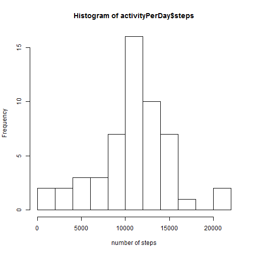
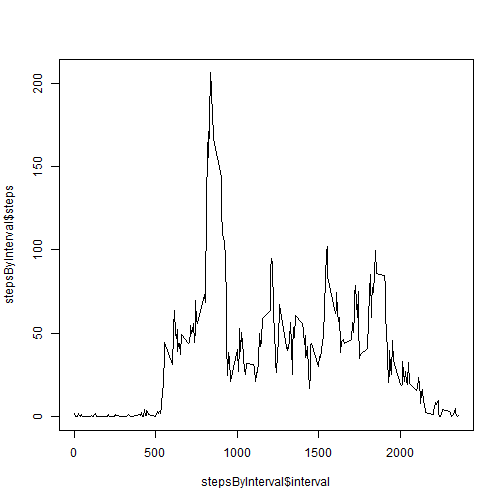
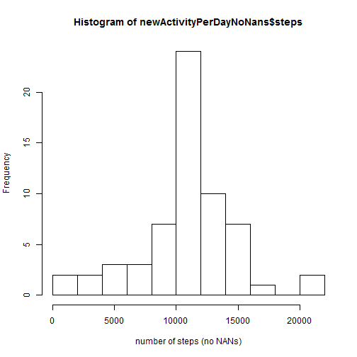
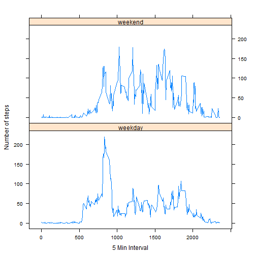

This markdown is about the activity data for the coursera "reproductible research" assigment 1, it will try to answer the questions on the assigment.

As the first step we load the data contained in the file "activity.csv" 

```r
activity <- read.csv("activity.csv")
summary(activity)
```

```
##      steps                date          interval     
##  Min.   :  0.00   2012-10-01:  288   Min.   :   0.0  
##  1st Qu.:  0.00   2012-10-02:  288   1st Qu.: 588.8  
##  Median :  0.00   2012-10-03:  288   Median :1177.5  
##  Mean   : 37.38   2012-10-04:  288   Mean   :1177.5  
##  3rd Qu.: 12.00   2012-10-05:  288   3rd Qu.:1766.2  
##  Max.   :806.00   2012-10-06:  288   Max.   :2355.0  
##  NA's   :2304     (Other)   :15840
```

We requiere to have the activity per day so we aggregate the data so we can also draw the corresponding plot

```r
activityPerDay <- aggregate(steps ~ date, activity, sum)

hist(activityPerDay$steps, breaks = 10, xlab = "number of steps")
```



#What is mean total number of steps taken per day?

From the aggregate we can then find the mean and median of steps


```r
median(activityPerDay$steps)
```

```
## [1] 10765
```

```r
mean(activityPerDay$steps)
```

```
## [1] 10766.19
```

#What is the average daily activity pattern?

the calculations for the intervals are perfomed and a new plot is drawn

```r
stepsByInterval <- aggregate(steps ~ interval, activity, mean)
plot(stepsByInterval$interval,stepsByInterval$steps, type = "l")
```


We then check the maximum number of steps in the intervals


```r
stepsByInterval[which.max(stepsByInterval$steps),]
```

```
##     interval    steps
## 104      835 206.1698
```

#Imputing missing values

We check the total number of missing values in the data

```r
sum(is.na(activity$steps))
```

```
## [1] 2304
```

In order to "eliminate" the NA values, we fill with the median of steps that correspond to the same date in which the NA value is, we create a new dataset that contains no NAs


```r
newActivityNoNAs <- activity
NAs <- which(is.na(newActivityNoNAs$steps))
NAsIntervals <- newActivityNoNAs$interval[NAs]
meansForNas <- function(interval){
  
  stepsByInterval$steps[which(stepsByInterval$interval== interval)]
}

#we get the means for each of teh interval that has NA value so we can fill those
means <- sapply(newActivityNoNAs$interval[NAs], meansForNas)

#we assignthe means to the NAs
newActivityNoNAs$steps[NAs] = means
```
A new histogram is generated with the new data set, to check if there has been any variance with the substitution of the NAs values


```r
summary(newActivityNoNAs)
```

```
##      steps                date          interval     
##  Min.   :  0.00   2012-10-01:  288   Min.   :   0.0  
##  1st Qu.:  0.00   2012-10-02:  288   1st Qu.: 588.8  
##  Median :  0.00   2012-10-03:  288   Median :1177.5  
##  Mean   : 37.38   2012-10-04:  288   Mean   :1177.5  
##  3rd Qu.: 27.00   2012-10-05:  288   3rd Qu.:1766.2  
##  Max.   :806.00   2012-10-06:  288   Max.   :2355.0  
##                   (Other)   :15840
```

```r
newActivityPerDayNoNans <- aggregate(steps ~ date, newActivityNoNAs, sum)
hist(newActivityPerDayNoNans$steps, breaks = 10, xlab = "number of steps (no NANs)")
```



```r
median(newActivityPerDayNoNans$steps)
```

```
## [1] 10766.19
```

```r
mean(newActivityPerDayNoNans$steps)
```

```
## [1] 10766.19
```

#Are there differences in activity patterns between weekdays and weekends?

We create and assign the factors of weekday or weekend to the dataset 


```r
newActivityNoNAs$date = as.Date(newActivityNoNAs$date)

factorWdayOrWend <- function(date){
  day <- weekdays(date)
  if(day %in% c("sabado","domingo","saturday","sunday")){
    as.factor("weekend")
  }
  else{
    as.factor("weekday")
  }
}

#the new weekend or weekday are set in the data set with no NAs for teh actovity
newActivityNoNAs$isWeek <- sapply(newActivityNoNAs$date,factorWdayOrWend)
```

Now that we have the new factor, we prepare the aggregate data to draw the plot and examin the difference in the activity in the weekend vs the weekdays


```r
#we preform the agregate on the new dataset with the weekday factor
wDayVSwEnd <- aggregate(steps ~ isWeek+interval, newActivityNoNAs, mean)

#load the librery to help us with the plot
library(lattice)

xyplot(steps ~ interval | factor(isWeek),
       layout = c(1, 2),
       xlab="5 Min Interval",
       ylab="Number of steps",
       type="l",
       lty=1,
       data=wDayVSwEnd)
```



There seems to be significant more activity on all the intervals on the weekend, but on the weekdays the peak on the interval 900 to 1000 is significantly higher , this is on early morning so we can infere or explore that this is because people do excersice on the start of the day, and in the weekend people move more during the day
